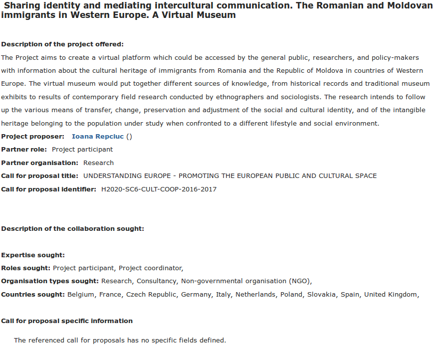

# PGPI - Tareas T3

> Francisco Javier Bolívar Lupiáñez

## Ejercicio 1

### Usar la plataforma *cordis* para buscar partners en consorcios formados para la petición de proyectos europeos relacionado con la temática del proyecto base de las prácticas (museos y TIC). Hacer una captura de los detalles de una de las ofertas. ¿Podría vuestro equipo ser uno de los partners que buscan? Justificad la respuesta. (https://cordis.europa.eu/partners/web/guest)

Entre los países buscados se encuentra España y, aunque no especifican los expertos buscados, es evidente que hace falta algún ingeniero informático para crear la plataforma del museo virtual.

## Ejercicio 2

### Buscar si la Universidad de Granada tiene algún proyecto de cooperación que necesite el uso de TICs con algún país no europeo. Usad los enlaces proporcionados en teoría u otros. Referenciar con un enlace a una página que hable de esa cooperación y resumid en un párrafo en qué consiste en concreto.

[ACP-UE Ciencia y Tecnología II](http://internacional.ugr.es/pages/proyectos/acpue-ciencia-y-tecnologia-ii). Colaboración con países de África, Caribe y Pacífico para salvar la brecha científica y tecnológica de estos países con respecto a otros más industrializados.

No obstante se desconoce la fecha de la próxima convocatoria de este proyecto.
