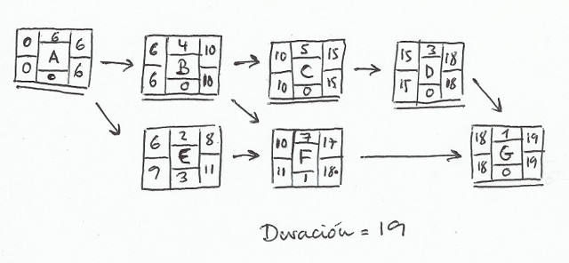
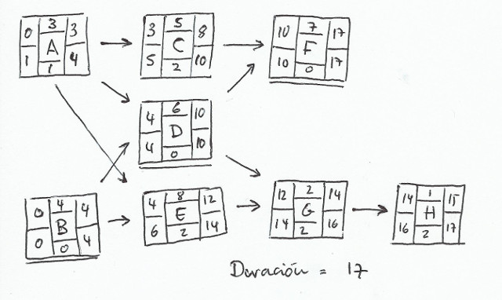

# PGPI - Tareas T4

> Francisco Javier Bolívar Lupiáñez

**Dadas las siguientes redes de tareas...**

**...obtenga:**

* **La hora de comienzo más temprana (ES) para cada tarea que nos permite completar todas las tareas en un tiempo mínimo.**
* **La hora de comienzo más tardía (LS) para cada tarea que nos permite completar las tareas en un tiempo mínimo.**
* **La holgura (slack) de cada tarea.**
* **Los caminos críticos de cada proyecto.**
* **La duración del plan óptimo para cada proyecto.**

Primera red:

Segunda red:

**Escenarios alternativos:**

* **¿Cuánto se alargaría la duración del proyecto si las tareas C y E requieren el uso exclusivo de un recurso específico? Asuma que nuestro presupuesto no nos permite adquirir varias unidades del recurso necesario.**

Respuesta

* **¿Cuál sería la duracion del proyecto si lo tenemos que hacer en solitario? En otras palabras, no podemos contratar a nadie para realizar tareas en paralelo.**

Respuesta
