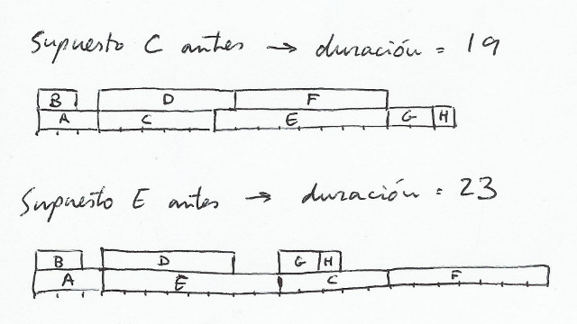

# PGPI - Tareas T4

> Francisco Javier Bolívar Lupiáñez

**Dadas las siguientes redes de tareas...**

**...obtenga:**

* **La hora de comienzo más temprana (ES) para cada tarea que nos permite completar todas las tareas en un tiempo mínimo.**
* **La hora de comienzo más tardía (LS) para cada tarea que nos permite completar las tareas en un tiempo mínimo.**
* **La holgura (slack) de cada tarea.**
* **Los caminos críticos de cada proyecto.**
* **La duración del plan óptimo para cada proyecto.**

Primera red:

Segunda red:

**Escenarios alternativos:**

* **¿Cuánto se alargaría la duración del proyecto si las tareas C y E requieren el uso exclusivo de un recurso específico? Asuma que nuestro presupuesto no nos permite adquirir varias unidades del recurso necesario.**

En la primera red no afectaría porque para ejecutarse C hace falta que se termine B que se podría ejecutar paralelamente a E.

En la segunda sí afecta pues C y E se ejecutan en paralelo, por lo que hay que elegir cuál ejecutar primero. A primera vista se intuye que C debería ser el que se ejecute primero pues es necesaria en el camino crítico. De todas formas, se comprueba viendo la duración del proyecto con las dos suposiciones:

Como se puede ver en la imagen la opción más asequible es hacer en primer lugar C. De esta forma solo se perderían dos unidades de tiempo con respecto a la original.

* **¿Cuál sería la duracion del proyecto si lo tenemos que hacer en solitario? En otras palabras, no podemos contratar a nadie para realizar tareas en paralelo.**

Sería la suma de la duración de todas las tareas. En la primera red 28 y en la segunda 36.
